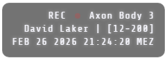
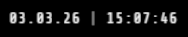

# Bodycam Overlay

Ein minimalistisches OBS-Overlay mit REC-Status, Gerät, Benutzer, Callsign, Datum, Uhrzeit und Zeitzone.

### Features
- Blinkender REC-Punkt
- Anzeige von Gerät, Benutzername & Callsign
- Echtzeit Datum & Uhrzeit mit Sekunden
- Zeitzone automatisch
- Transparentes Overlay, Schrift: Share Tech Mono
- verschiedene Overlays

### Konfiguration
Im `<script>`-Block:

```javascript
const CONFIG = {
    player: "David Laker |",
    callsign: "[12-200]",
    deviceName: "Axon Body 3"
};
````

## Usage (OBS Einbindung)
### 1. Datei speichern
Speichere die gewünschte Overlay-Datei in einem festen Ordner, der nicht verschoben wird.
**Hinweis:** Es gibt zwei Varianten:
- **Bodycam 1 (`bodycam.html`)** → Standard-Overlay mit allen Elementen
- **Bodycam 2 (`bodycam2.html`)** → Clean-Overlay (ohne zusätzliche UI-Elemente)

### 2. In OBS einbinden
1. OBS öffnen
2. Szene auswählen
3. Bei **Quellen** auf **+** klicken
4. **Browser** auswählen
5. Namen vergeben (z.B. Bodycam Overlay)
6. **Lokale Datei** aktivieren
7. Die `bodycam.html` auswählen
8. Größe anpassen

# Overlay Preview
## Preview 1 - Enthält alle UI-Elemente.


## Preview 2 - Ohne zusätzliche UI-Elemente.

